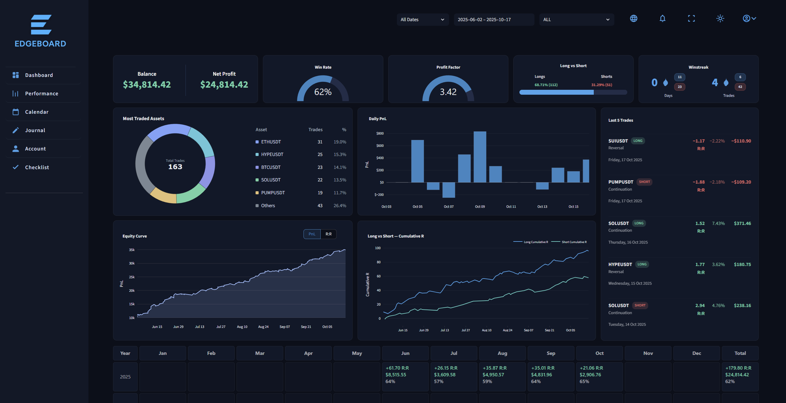
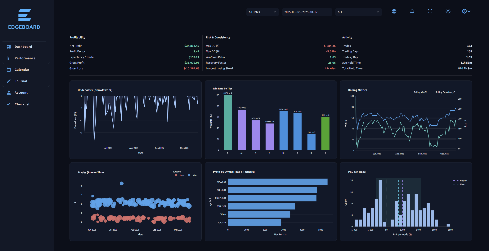
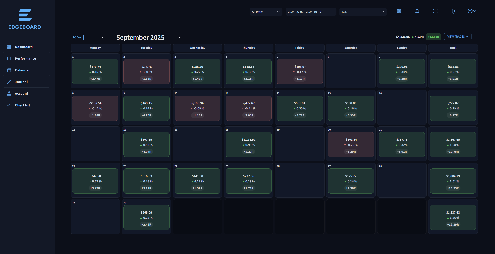
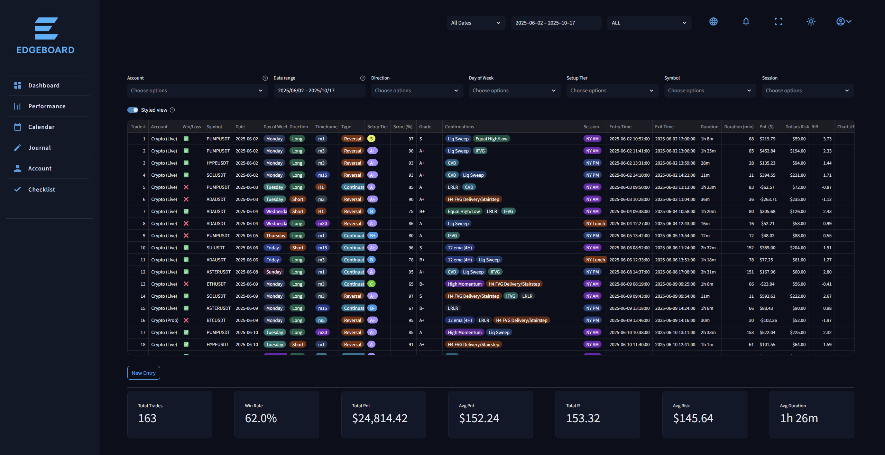
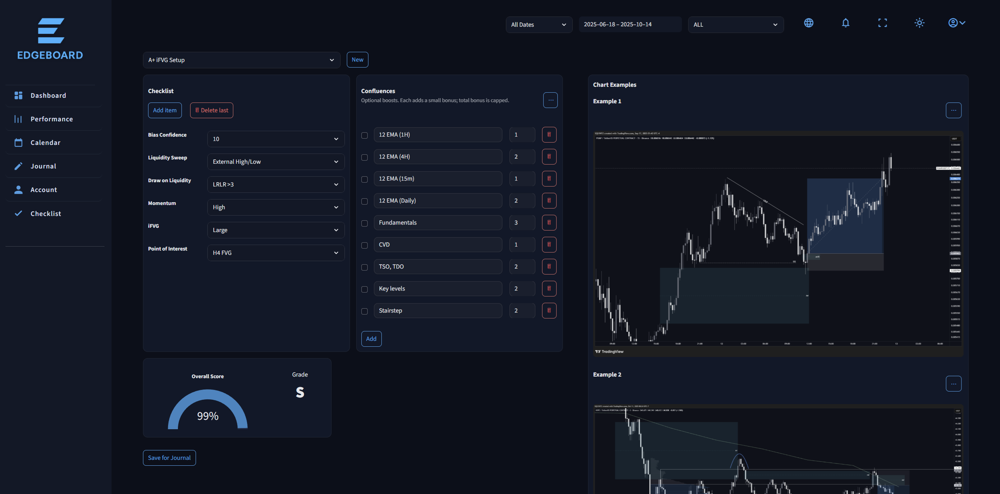

# 🧭 Edgeboard

**Edgeboard** is a personal trading analytics dashboard built with **Streamlit + Python**, designed to analyze performance, track journaling habits, and visualize trading data through a clean, modular interface.  
It’s my main data companion for evaluating setups, refining edge quality, and staying objective in live markets.

---

## 🌐 Overview

Edgeboard consolidates all aspects of trade tracking into one visual workspace:
- Performance analytics
- Equity & drawdown tracking
- Journal review
- Calendar-based summaries
- Setup checklists and grading

Everything updates dynamically through CSV imports or live journaling, with all pages connected through a shared state system.

---

## 🧩 Features

### **Dashboard**
A high-level snapshot of account performance:
- KPI cards for Balance, Net Profit, Win Rate, Profit Factor, and Long/Short distribution  
- Equity curve and daily PnL bars  
- Cumulative R:R chart by direction  
- Last 5 Trades summary and monthly performance grid

### **Performance**
Deep-dive analytics:
- Profitability breakdown (Expectancy, Recovery Factor, Win/Loss ratio)
- Drawdown visualization (“Underwater” chart)
- Rolling win rate and expectancy tracking
- Tier-based win rate bars
- Profit per symbol, PnL distribution histograms, and trade scatter plots

### **Calendar**
- Interactive monthly grid showing daily PnL, %, and R:R  
- Color-coded by performance intensity  
- Weekly totals and a "View Trades" button for detailed context

### **Journal**
- Structured trade log with filtering for Date, Symbol, Direction, Session, Tier, etc.  
- Inline metrics for each entry (PnL, Risk, Duration, etc.)  
- Aggregated stats footer for quick session review

### **Checklist**
- Dynamic setup checklist and confluence builder  
- Weighted scoring system producing an overall grade (S / A+ / A / etc.)  
- Optional image examples for setup visualization

### **Account**
- Starting equity and profile preferences  
- Tabs for future expansion (e.g., guide or preset management)

---

## ⚙️ Tech Stack

| Category | Tools / Libraries |
|-----------|-------------------|
| **Frontend** | [Streamlit](https://streamlit.io/), Plotly, HTML/CSS (custom theme) |
| **Backend** | Python (pandas, numpy) |
| **Visualization** | Plotly Graph Objects, Express |
| **Data Handling** | CSV-based journal sync with pandas |
| **Design System** | Custom dark theme defined in `src/theme.py` and `src/styles.py` |

---

## 🧱 Project Structure
src/
├── app.py # main entrypoint
├── theme.py # color and style constants
├── styles.py # injected CSS + layout overrides
├── io.py, utils.py, state.py, metrics.py
│
├── charts/ # all Plotly charts
│ ├── equity.py
│ ├── drawdown.py
│ ├── rr.py
│ ├── pnl.py
│ ├── long_short.py
│ └── tier_wr.py
│
├── components/ # UI submodules
│ ├── monthly_stats.py
│ ├── winstreak.py
│ └── last_trades.py
│
└── views/ # page-level views
├── overview.py
├── performance.py
├── calendar.py
├── journal.py
├── account.py
└── checklist.py


---

## 💡 Design Philosophy

Edgeboard was built to feel like a native trading app:
- Fast, minimal, and data-driven  
- Every metric and chart is contextual — not decorative  
- Focused on **clarity over complexity**  
- Modular enough to expand into a full trade-tracking ecosystem later

---

## 🖼️ Screenshots

| Dashboard | Performance | Calendar |
|------------|--------------|-----------|
|  |  |  |

| Journal | Checklist |  |
|----------|------------|--|
|  |  |  |


---

## 🧠 Future Plans
- Add backtesting and trade tagging integration  
- Export performance reports as PDFs  
- Optional login & multi-account syncing  
- AI-assisted journaling and trade feedback  

---

## 👤 Author

Built by **Jordan Chen**, combining data analytics, trading psychology, and visualization design into a cohesive daily tool.  
It’s a work in progress — but already an edge in itself.

---

## 📜 License

MIT License © 2025  
Feel free to fork, learn, or build your own version.

---

## Run locally
```bash
# from the project folder (with venv activated)
streamlit run app.py
